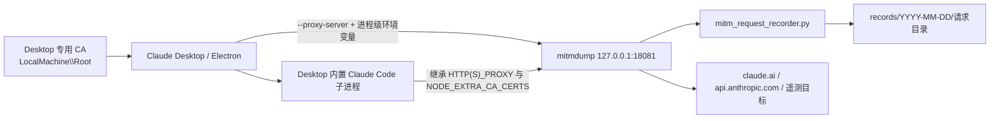

# Claude Desktop 官方请求记录、桌面自动化与遥测分析知识包

本文记录在远端家宽 Windows Server 上，对官方 Claude Desktop 与其内置 Claude Code 请求进行完整记录、真实桌面操作验证和遥测分析的可复现方法。配套脚本位于本目录 `scripts`。

本文档针对的是：

- 官方 Microsoft Store/MSIX Claude Desktop
- 原有 Claude.ai/Pro 官方登录态
- 官方 `claude.ai`、`api.anthropic.com` 等目标
- 不搭建 API Key 中转
- 不设置 `ANTHROPIC_BASE_URL`
- 不脱敏保存 Authorization、Cookie、OAuth、请求头和请求正文
- 只代理 Claude Desktop，不设置 Windows 全局代理

## 1. 已验证环境

实测环境：

| 项目 | 值 |
|---|---|
| 服务器 | 家宽 Windows Server 2025 |
| 账户 | `Administrator` |
| Claude Desktop | MSIX `1.24012.9.0` |
| Electron | `42.7.0` |
| Chrome | `148.0.7778.280` |
| 安装包名 | `Claude_1.24012.9.0_x64__pzs8sxrjxfjjc` |
| Package Family | `Claude_pzs8sxrjxfjjc` |
| Desktop 可执行文件 | `C:\Program Files\WindowsApps\Claude_*\app\Claude.exe` |
| Desktop 内置 Claude Code | `2.1.219` |
| 独立 Claude Code CLI | `2.1.220` |

MSIX 更新后版本目录会变化。启动脚本不能把当前完整路径永久写死，必须每次用 `Get-AppxPackage -Name Claude` 动态解析 `InstallLocation`。

## 2. 总体架构



核心设计：

1. mitmdump 仅监听回环地址 `127.0.0.1:18081`。
2. Claude Desktop 主进程通过 Electron 参数 `--proxy-server=http://127.0.0.1:18081` 使用代理。
3. 同时给该进程设置 `HTTP_PROXY`、`HTTPS_PROXY`、`NO_PROXY`、`NODE_EXTRA_CA_CERTS`，覆盖内置 Node/Claude Code 子进程。
4. 不修改 Windows 系统代理，因此 Edge、Firefox、系统服务等不会进入该记录器。
5. Chromium 使用 Windows 根证书库，专用 mitmproxy CA 通过 .NET `X509Store` 写入 `LocalMachine\Root`。
6. 记录器保持请求正文缓冲，响应正文则启用流式转发，避免破坏 SSE 和下载体验。

## 3. 与独立 Claude Code 记录器隔离

| 项目 | Claude Code CLI | Claude Desktop |
|---|---|---|
| 目录 | `C:\Users\Administrator\ClaudeCodeRequestRecorder` | `C:\Users\Administrator\ClaudeDesktopRequestRecorder` |
| 端口 | `18080` | `18081` |
| 代理任务 | `ClaudeCodeRequestRecorderProxy` | `ClaudeDesktopRequestRecorderProxy` |
| 启动任务 | 无 | `ClaudeDesktopRecordedLaunch` |
| CA 信任 | `NODE_EXTRA_CA_CERTS` | `LocalMachine\Root` + `NODE_EXTRA_CA_CERTS` |
| 应用配置 | `.claude\settings.json` | Electron 启动参数与进程环境 |

两套记录器各自拥有 `bin`、`mitmproxy-home`、`runtime` 和 `records`，互不覆盖。

## 4. 远端运行目录

```text
C:\Users\Administrator\ClaudeDesktopRequestRecorder\
├── bin\mitmdump.exe
├── bin\_internal\
├── mitm_request_recorder.py
├── run-proxy.ps1
├── configure-remote.ps1
├── launch-recorded.ps1
├── restart-recorded.ps1
├── inspect-latest.ps1
├── verify-recording.ps1
├── audit-recording.ps1
├── disable-recording.ps1
├── mitmproxy-home\
├── runtime\
└── records\YYYY-MM-DD\<每个请求目录>\
```

每个请求目录示例：

```text
225744-176043_<flow-id>_POST_api.anthropic.com_v1_messages\
├── request.json
├── request-body.raw.bin
├── request-body.txt
└── response.json
```

## 5. 请求记录格式

### `request.json`

记录：

- 捕获时间和 mitmproxy flow ID
- 客户端地址
- method、完整 URL、scheme、host、port、path
- HTTP 版本
- 保留重复项的原始请求头数组
- 正文长度、SHA-256、文件名
- `redacted: false`

请求头使用二维数组而不是对象，目的是保留 HTTP/2 中重复的 `cookie` 字段。Chromium 会把 Cookie 拆成多个 header field；因此 Cookie 字段数量可能远大于请求数量。

### `request-body.raw.bin`

完整请求正文原始字节。验收脚本重新计算 SHA-256，与 `request.json` 中保存的值比较。

### `request-body.txt`

当 Content-Type 包含 JSON、text、XML、JavaScript、表单或 GraphQL 时，额外保存便于阅读的 UTF-8/文本副本。原始二进制文件始终是权威数据。

### `response.json`

只记录状态码、HTTP 版本和响应头。响应正文不落盘，因为 Claude 的 `/v1/messages` 使用 SSE；若在 `response()` 阶段缓存完整响应，会破坏流式体验或显著增加延迟。

### WebSocket

客户端发出的 WebSocket frame 保存为：

```text
websocket-client-00001.bin
```

## 6. 部署方法

配套源文件位于 `scripts/recorder`。部署时将其中脚本平铺复制到目标运行目录。

### 6.1 准备 mitmdump

本次没有重复上传约 65 MB 的独立二进制，而是从已有 CLI 记录器复制：

```text
C:\Users\Administrator\ClaudeCodeRequestRecorder\bin
    ↓
C:\Users\Administrator\ClaudeDesktopRequestRecorder\bin
```

`configure-remote.ps1` 会在 Desktop 目录缺少 `bin\mitmdump.exe` 时自动执行该复制。

### 6.2 常驻代理任务

任务以 SYSTEM、最高权限、开机触发运行：

```text
ClaudeDesktopRequestRecorderProxy
```

动作：

```powershell
powershell.exe -NoProfile -WindowStyle Hidden -ExecutionPolicy Bypass `
  -File C:\Users\Administrator\ClaudeDesktopRequestRecorder\run-proxy.ps1
```

任务无限执行、失败后每分钟重启、忽略重复实例。

### 6.3 CA 信任

非交互 SSH 会话中，以下方式在实测机器上失败：

- `Import-Certificate` 写入 CurrentUser Root：`UI is not allowed`
- `certutil -user`：`0x80070032`

可靠做法是管理员权限下直接使用：

```powershell
$store = [Security.Cryptography.X509Certificates.X509Store]::new(
    'Root',
    [Security.Cryptography.X509Certificates.StoreLocation]::LocalMachine
)
$store.Open([Security.Cryptography.X509Certificates.OpenFlags]::ReadWrite)
$store.Add($caCertificate)
$store.Close()
```

这只建立证书信任，不设置全局 HTTP 代理。停用脚本根据专用 CA 的精确 Thumbprint 删除对应信任项。

### 6.4 ACL

以下目录禁用继承，只授予当前 Administrator 与 SYSTEM FullControl：

- `records`
- `mitmproxy-home`
- `runtime`

原因是其中包含可复用 OAuth Bearer、Cookie、CA 私钥、提示词、代码和工具结果。

## 7. Desktop 启动和 Electron 单实例

`.claude\settings.json` 不适用于 Claude Desktop。专用启动器动态解析官方 MSIX 后执行：

```text
Claude.exe --proxy-server=http://127.0.0.1:18081
```

同时创建：

- 桌面 `Claude (Recorded)`
- 开始菜单 `Claude (Recorded)`
- 登录任务 `ClaudeDesktopRecordedLaunch`

Claude Desktop 是 Electron 单实例应用：

- 若记录模式主实例已经运行，点击普通 Claude 图标只是唤醒该主实例，后续请求仍被记录。
- 若先彻底退出，再由普通官方图标创建无代理主实例，则不会记录。
- 记录入口检测到无代理主实例时会拒绝“假启动”，提示彻底退出后重试。
- 登录任务让带代理实例在 Administrator 登录服务器后优先成为主实例。

不要用进程名粗暴结束 `claude.exe`。Windows 进程名比较不区分大小写，可能误伤独立 CLI。必须按完整路径筛选：

```text
C:\Program Files\WindowsApps\Claude_*\app\Claude.exe
```

## 8. 真实 Code 页面测试方法

SSH 会话不在 RDP 的交互桌面中，直接从 SSH 启动 UI Automation 无法可靠控制 Session 2。正确方法：

1. 上传 UI Automation worker。
2. 创建 `LogonType Interactive` 的临时计划任务，用户为已登录 Administrator。
3. 手工 `Start-ScheduledTask`，使 worker 在现有 RDP Session 2 中执行。
4. 用 Windows UI Automation 定位窗口和控件。
5. 发送后轮询界面文本，并同时检查网络记录。
6. 删除临时计划任务，保留正式记录器任务。

实测控件：

| 作用 | UI Automation 特征 |
|---|---|
| 主窗口 | `Chrome_WidgetWin_1`，窗口名 `Claude` |
| Web 文档 | `ControlType.Document`，URL `https://claude.ai/epitaxy...` |
| Code 输入框 | Name=`Prompt`，ClassName 以 `tiptap ProseMirror` 开头 |
| Send | Name=`Send`，`ControlType.Button`，支持 `InvokePattern` |

输入框是 ProseMirror `Group`，没有可写 `ValuePattern`。需要：

1. `SetFocus()`；
2. 通过真实键盘输入路径发送字符，让 React/ProseMirror 收到正常 input 事件；
3. 等待 Send 按钮从 disabled 变为 enabled；
4. 调用 `InvokePattern.Invoke()`。

实测消息：

```text
Reply with exactly DESKTOP_RECORDER_OK
```

界面回复：

```text
DESKTOP_RECORDER_OK
```

自动创建的 Code 会话标题为 `Desktop recorder OK`。

## 9. Code 测试对应的官方请求

搜索测试标记共得到一条标题请求和三条 `/v1/messages?beta=true`：

| 顺序 | Endpoint | 模型 | 正文字节 | stream | max_tokens | tools | 状态 |
|---|---|---:|---:|---:|---:|---:|---:|
| 标题 | `claude.ai/.../dust/generate_title_and_branch` | `claude-opus-5` | 114 | - | - | - | 200 |
| 1 | `api.anthropic.com/v1/messages?beta=true` | `claude-haiku-4-5-20251001` | 2,337 | true | 32,000 | 0 | 200 |
| 2 | `api.anthropic.com/v1/messages?beta=true` | `claude-opus-5` | 97,553 | true | 64,000 | 40 | 200 |
| 3 | `api.anthropic.com/v1/messages?beta=true` | `claude-haiku-4-5-20251001` | 18,612 | 未设置 | 1,024 | 0 | 200 |

第二条是主 Code agent 请求。三条 Messages 请求均保存完整 115 字节 Bearer，原始正文 SHA-256 全部匹配。

## 10. 遥测请求分类与实测内容

### 10.1 Claude Code 内部事件

```text
POST https://api.anthropic.com/api/event_logging/v2/batch
User-Agent: claude-code/2.1.219
Authorization: Bearer ...
Content-Type: application/json
```

一次 Code 测试后观察到一个 357,526 字节批次，包含 177 个 `ClaudeCodeInternalEvent`：

```json
{
  "events": [
    {
      "event_type": "ClaudeCodeInternalEvent",
      "event_data": {
        "event_name": "tengu_api_success",
        "model": "claude-opus-5",
        "session_id": "...",
        "client_type": "claude-desktop",
        "entrypoint": "claude-desktop",
        "env": {
          "platform": "win32",
          "version": "2.1.219",
          "arch": "x64"
        },
        "auth": {
          "organization_uuid": "...",
          "account_uuid": "..."
        },
        "device_id": "..."
      }
    }
  ]
}
```

常见事件：

- `tengu_api_success`
- `tengu_mcp_tools_listed`
- `tengu_tool_search_mode_decision`
- `tengu_skill_loaded`
- `tengu_api_cache_breakpoints`
- `tengu_sysprompt_block`
- `tengu_sdk_control_roundtrip`

### 10.2 Desktop UI 事件

```text
POST https://claude.ai/api/event_logging/v2/batch
```

观察到：

- `desktop_ccd_message_cycle_start`
- `desktop_ccd_message_cycle_outcome`
- `desktop_ccd_stream_render`
- `desktop_ccd_terminal_spawned`
- `desktop_ccd_session_initialized`
- `desktop_feature_exposure`

metadata 中包含应用版本、MSIX 变体、OS build、CPU 型号、总内存、空闲内存、Electron 各进程 RSS/CPU、窗口数量、运行时长、组织 ID 等。

### 10.3 Datadog RUM

```text
POST https://browser-intake-us5-datadoghq.com/api/v2/rum
Content-Type: text/plain;charset=UTF-8
```

正文是 JSONL，记录：

- view 路由和 URL 模板
- RUM session、user、organization、plan
- viewport 尺寸
- resource/fetch 耗时
- long task、UI 卡顿、页面加载
- 前后台状态、网络类型
- Desktop/Electron/Chrome 版本

### 10.4 Datadog Claude Code 日志

```text
POST https://http-intake.logs.us5.datadoghq.com/api/v2/logs
```

一次观察到 145,449 字节、85 条记录，包含模型、session ID、MCP 初始化、插件和 skill 加载、API 耗时、内存、CPU、平台、订阅类型等。

### 10.5 Segment/Amplitude

```text
POST https://a-api.anthropic.com/v1/b
```

正文包含 `writeKey`、`batch` 和 `sentAt`。事件包括：

- `claudeai.code.session.ttft`
- `claudeai.perf.interaction_histogram`

traits 中可包含完整邮箱、账号 UUID、组织 UUID、国家、套餐、billing type、注册时间和 consent 配置。

```text
POST https://a-api.anthropic.com/v1/m
```

用于发送 `analytics_js.integration.invoke` 等计数器。

### 10.6 是否携带提示词

对上述六类代表性遥测包搜索测试提示词和回复，精确命中数均为 0。测试提示词原文出现在 `/v1/messages?beta=true` 中。

这只是该次实测结论，不能推导所有版本、所有错误路径或所有未来遥测永远不包含内容。记录器应继续保存原始数据，以便逐版本核验。

## 11. 分析与验收命令

### 查看最近请求

```powershell
powershell -ExecutionPolicy Bypass -File `
  C:\Users\Administrator\ClaudeDesktopRequestRecorder\inspect-latest.ps1 `
  -Limit 20 -ShowBody
```

### 完整安装审计

```powershell
powershell -ExecutionPolicy Bypass -File `
  C:\Users\Administrator\ClaudeDesktopRequestRecorder\audit-recording.ps1
```

核对：

- 两个代理端口和任务
- Desktop 主进程代理参数
- CA Thumbprint 和信任
- ACL 是否只含 Administrator/SYSTEM
- Authorization/Cookie 字段存在性
- 所有正文长度和 SHA-256
- error 文件数量

### 查找 Messages 模型请求

知识包脚本：

```powershell
powershell -ExecutionPolicy Bypass -File `
  .\scripts\analysis\find-message-requests.ps1 `
  -RecorderRoot C:\Users\Administrator\ClaudeDesktopRequestRecorder `
  -SearchText DESKTOP_RECORDER_OK
```

### 遥测分类

```powershell
powershell -ExecutionPolicy Bypass -File `
  .\scripts\analysis\analyze-telemetry.ps1 `
  -RecorderRoot C:\Users\Administrator\ClaudeDesktopRequestRecorder `
  -SearchText DESKTOP_RECORDER_OK
```

## 12. 远端执行经验

### 12.1 远端没有 Python

远端 Windows Server 没有可用 Python，因此：

- 文件上传、SSH Host Key 校验和命令编排在本机使用 Python/Paramiko；
- 远端证书、任务计划、UI Automation 和日志分析使用 PowerShell；
- 读取本地中文文件优先 Python UTF-8，避免 PowerShell 管道编码问题。

### 12.2 PowerShell 命令行长度

大型脚本使用 `-EncodedCommand` 会超过 Windows 命令行长度并报：

```text
The command line is too long.
```

可靠流程：

1. 本地保存 `.ps1`；
2. SFTP 上传；
3. 执行 `powershell.exe -File <远端路径>`。

`scripts/remote/ssh_upload_and_run.py` 实现了该流程，并验证服务器 Host Key SHA-256。

### 12.3 非交互输出编码

远端 PowerShell 5.1 建议显式设置：

```powershell
[Console]::OutputEncoding = [Text.Encoding]::UTF8
```

本机 Python 输出建议：

```python
sys.stdout.reconfigure(encoding="utf-8", errors="backslashreplace")
```

### 12.4 计划任务返回码

长期运行任务的 `LastTaskResult = 267009` 即 `0x41301`，表示任务当前正在运行，不是失败。

## 13. 安全与技术边界

1. 记录器不脱敏，日志含可复用 OAuth、Cookie 和私有内容。
2. CA 私钥必须和 records 一样严格限制 ACL。
3. Desktop CA 写入 `LocalMachine\Root`；虽然没有设置全局代理，但仍应在停用时删除精确 Thumbprint。
4. Anthropic 上游看到的 TLS/HTTP 客户端是 mitmproxy，而不是原生 Electron/Claude Code TLS 指纹。
5. 记录的是最终应用层请求；适合分析 model、tools、CCH、beta、headers 和 body，不适合研究原生 TLS/HTTP2 指纹。
6. 响应正文默认不记录；若研究 SSE 内容，需要另做不破坏流式的 tee，实现和风险不同。
7. 没有自动日志清理，磁盘占用会持续增长。
8. MSIX 更新、Electron 网络栈变化、Anthropic 端点变化后应重新验收。
9. UI Automation 依赖已登录的交互桌面；RDP 完全断开或锁屏时截图/键盘注入可能失败。
10. 桌面自动化测试会真实创建会话并向官方发送消息，属于外部状态变更。

## 14. 停用和恢复

先完全退出 Claude Desktop，然后：

```powershell
powershell -ExecutionPolicy Bypass -File `
  C:\Users\Administrator\ClaudeDesktopRequestRecorder\disable-recording.ps1
```

需要同时结束带代理 Desktop：

```powershell
powershell -ExecutionPolicy Bypass -File `
  C:\Users\Administrator\ClaudeDesktopRequestRecorder\disable-recording.ps1 `
  -StopClaude
```

停用会：

- 删除 `ClaudeDesktopRecordedLaunch`
- 删除 `ClaudeDesktopRequestRecorderProxy`
- 删除专用快捷方式
- 删除专用 CA 的 `LocalMachine\Root` 信任
- 保留历史 `records` 和 CA 文件

## 15. 脚本索引

### `scripts/recorder`

| 文件 | 用途 |
|---|---|
| `mitm_request_recorder.py` | mitmproxy addon，完整保存所有出站请求 |
| `run-proxy.ps1` | 在 18081 启动 mitmdump |
| `configure-remote.ps1` | 复制二进制、设 ACL、建任务、导入 CA、建快捷方式 |
| `launch-recorded.ps1` | 动态解析 MSIX 并启动记录模式 |
| `restart-recorded.ps1` | 只按完整 Desktop 路径重启为记录模式 |
| `inspect-latest.ps1` | 查看最近请求和正文 |
| `verify-recording.ps1` | 快速检查代理、CA、主进程和最近请求 |
| `audit-recording.ps1` | 全量 SHA-256、ACL、凭据头、任务和端口审计 |
| `disable-recording.ps1` | 停用并删除专用 CA 信任，保留日志 |

### `scripts/automation`

| 文件 | 用途 |
|---|---|
| `ui-inspect.ps1` | 导出 Claude UI Automation 树并截图 |
| `ui-send-code-test.ps1` | 在 Code Prompt 输入并点击 Send |
| `ui-code-test-worker.ps1` | 发送后等待预期界面回复的交互 worker |
| `invoke-code-ui-test.ps1` | 从 SSH 会话注册临时 Interactive 任务、执行 worker 并清理 |

### `scripts/analysis`

| 文件 | 用途 |
|---|---|
| `find-message-requests.ps1` | 按文本标记检索 `/v1/messages`，输出模型、tools、hash 和状态 |
| `analyze-telemetry.ps1` | 分类遥测端点、事件名、大小、状态和正文命中 |

### `scripts/remote`

| 文件 | 用途 |
|---|---|
| `ssh_upload_and_run.py` | Paramiko 上传 `.ps1` 并以 `-File` 执行，严格校验 Host Key |
| `ssh-config.example.toml` | 不含凭据的配置示例 |

## 16. 实测验收快照

部署后曾完成以下验收：

- Desktop 主进程位于 RDP Session 2；
- 命令行包含 `--proxy-server=http://127.0.0.1:18081`；
- `18080` 与 `18081` 同时监听，CLI 未受影响；
- Desktop 代理任务 Running，stderr 为空；
- 专用 CA 已信任；
- records、CA home、runtime ACL 仅 Administrator/SYSTEM；
- 早期全量审计 142 条请求、53 个正文、0 个 hash 不一致、0 个 error；
- 完成 Code UI 测试后记录数量达到 401，并继续增长；
- 测试消息得到正确界面回复，官方 Messages 请求全部 200。

这些数字是某一时刻的快照，不应作为固定断言；真正健康状态应通过脚本动态检查。
